# CATAN-PREDICTOR

catan-predictor is a digital version of the popular board game Catan, where players build settlements, 
roads, and cities to collect resources and earn points. 
The goal is to strategically plan and trade to be the first to reach the winning number of points.
This game offers fun and tactical challenges, perfect for fans of board games and strategy.

## How to run?

To enjoy the board game catan you need to download the project and run the following command in the terminal.

    lein run

After executing the command, an interactive GUI will open.

# Game 
### Games component
- 19 area hexes
- 54 spots for potentially building settlements and towns
- 72 edges where potentially could make road
- 18 number tokens
- resources card 
  - wood, 
  - wool, 
  - brick, 
  - ore and 
  - grain
  - 
- development card 
  - 14 knights , 
  - 5 victory points and
  - 2 road building card
- 2 special cards 
  - biggest army and 
  - longest road
- towns
- settlements
- roads
- 2 dice
- 1 robber

### Map Generation
The game board is dynamically generated by randomly placing terrain hexes to form the map layout. 
In addition, number tokens (used to determine resource production based on dice rolls) 
are also randomly assigned to the center of each hex, ensuring a unique and unpredictable setup every time the game starts.

### Map Explanation

Each area present area rich in one resource :

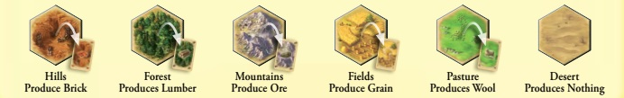

Edges and spots are used to build infrastructure on the map.
Spots can be used to build settlements and towns.
Edges can be used to build roads.
Numbers are used to determine when and from where resources can be collected from the map.
In this specific example, we see that the area is rich in ore, 
it borders other areas, and the edges and spots between them are still without infrastructure.

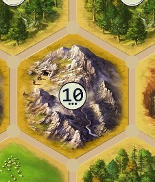

The map also includes a thief, who starts the game positioned in the desert.
Throughout the game, the thief will move around the map and block resource collection from the area where it is currently located.
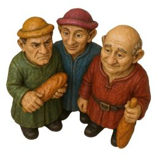

### Game view

On the start screen, there is a map, an "Add Player" button, a label to enter the player's name, and a color selection for the desired player.
There is also a table displaying the current players and a "Start Game" button to begin the game.

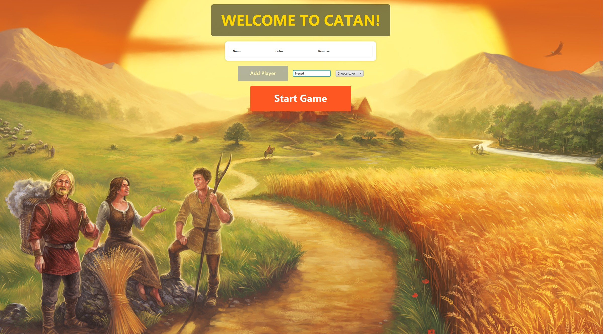

### View Elements in Game

<table>
  <tr>
    <td><strong>Table</strong> 
      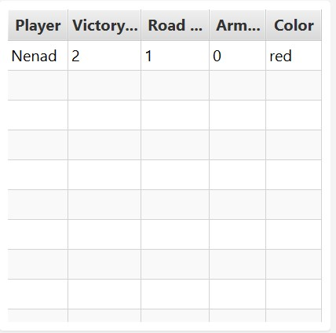
    </td>
    <td><strong>Buttons</strong> 
      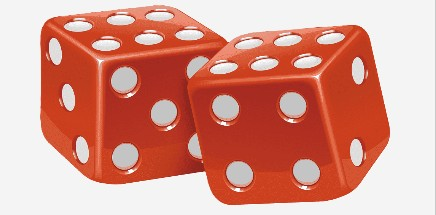
       
      
       
      
      
      
    </td>
  </tr>
  <tr>
    <td><strong>Dice Result View</strong> 
      
    </td>
    <td><strong>Development Card View</strong> 
      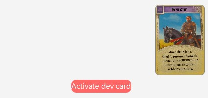
    </td>
  </tr>
  <tr>
    <td><strong>Player's Resource Hand</strong> 
      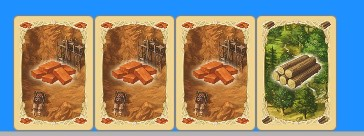
    </td>
    <td><strong>Shop</strong> 
      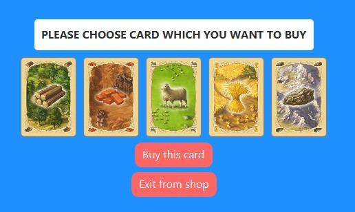
    </td>
  </tr>
  <tr>
    <td><strong>Top Message Display</strong> 
      
    </td>
    <td><strong>Settlements, Roads, and Towns</strong> 
      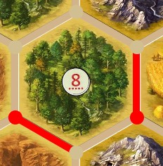
      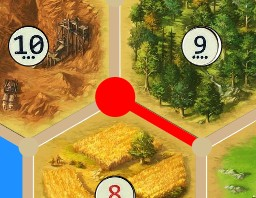
    </td>
  </tr>
</table>

### Asset

#### Numbers and Resources

<table>
  <tr>
    <td>
      <strong>Numbers</strong> 
      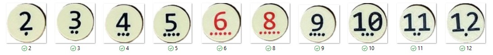
    </td>
    <td>
      <strong>Forests - Produce Wood</strong> 
      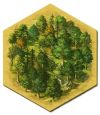
    </td>
    <td>
      <strong>Hills - Produce Brick</strong> 
      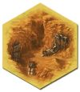
    </td>
    <td>
      <strong>Pasture - Produce Wool</strong> 
      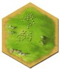
    </td>
  </tr>
  <tr>
    <td>
      <strong>Mountains - Produce Ore</strong> 
      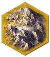
    </td>
    <td>
      <strong>Fields - Produce Grain</strong> 
      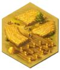
    </td>
    <td>
      <strong>Desert - Produces Nothing</strong> 
      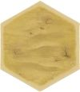
    </td>
    <td>
      <strong>Wood</strong> 
      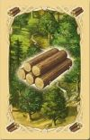
    </td>
  </tr>
  <tr>
    <td>
      <strong>Brick</strong> 
      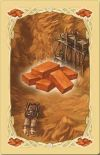
    </td>
    <td>
      <strong>Wool</strong> 
      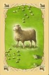
    </td>
    <td>
      <strong>Grain</strong> 
      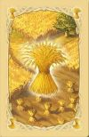
    </td>
    <td>
      <strong>Ore</strong> 
      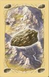
    </td>
  </tr>
</table>

#### Development Cards

<table>
  <tr>
    <td>
      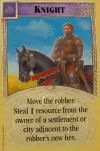 
      <strong>Knight</strong> 
      This card, when activated, allows the player to relocate the thief figure to any desired area.
    </td>
    <td>
      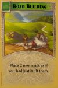 
      <strong>Road Building</strong> 
      This card, when activated, grants the player the ability to build two roads.
    </td>
    <td>
      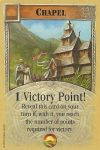 
      <strong>Victory Point</strong> 
      The card is not activated. When a player draws this card, they automatically receive one victory point.
    </td>
  </tr>
</table>

## Rules

### Resource Collection

Players receive resources if they have a settlement or town adjacent to resource areas.
They receive the resources produced by the adjacent areas.

- If a settlement is adjacent to an area, the player receives 1 resource from that area.
- If a town is adjacent to an area, the player receives 2 resources from that area.

### Building 

To build roads, settlements, and towns, you must be the current player 
(it must be your turn) and have the required resources in your hand. 
The resources needed for construction are as follows:

- Roads - 1 brick resource and 1 wood resource
- Settlements - 1 brick resource, 1 wood resource, 1 wool resource and 1 grain resource
- Towns - 2 grain resource and 3 ore resource
- Development Card - 1 wool resource, 1 grain resource and 1 ore resource

Roads can only be built if there is a town, settlement, or another road adjacent to the location.
Roads cannot be built randomly anywhere on the map.

Settlements can be built only if there is a road directly next to the building spot.
Settlements must be connected by a road.
Settlements cannot be built if there is another settlement within two road lengths from the new settlement.
This means that to build a settlement, it must be at least two roads away from any other settlement.

Towns can be built only on spots where there is already a settlement.

### Role dice

- When the dice are rolled, all players receive resources if they have settlements adjacent to
the resource area corresponding to the number rolled.
- If a player rolls a 7, all players who have
more than 7 resource cards in their hand (8 or more) must discard half of their cards.

- The player who rolled the 7 gets to move the thief figure to any area they choose.

### Thief role
- When the thief figure is placed on an area, that area becomes restricted.
- If the number corresponding 
to that area is rolled on the dice, no player receives resources from that area.

### Activate development cards

- Cards can be activated at any time during the game.
- The explanation for each card can be found in the Development Card section.

### Longest Road
- A player receives the Longest Road card if they have 
a road of length 3 or more, and their road is the longest compared to all other players.
- If multiple players have the same longest road length, the card stays with 
the player who first reached that length.

### Biggest Army

- A player who has activated 3 or more "knight" development cards 
and has the most activated "knight" cards has the right to the Largest Army card.
- If multiple players have the same number of activated knight cards, the card 
goes to the player who first reached that number of activated knight cards.

### Trade

A player has the right to trade 4 identical resources for 1 resource of their choice.

- For example, a player can trade 4 grain resources for 1 wood resource.

### Victory points

A player can earn victory points by owning the following:
- Settlement -> 1 victory point
- Town -> 2 victory point
- Biggest Army -> 2 victory point
- Longest Road -> 2 victory point
- Victory point Development Card -> 1 victory point

## How to Play

At the beginning of the game, each player enters their name and selects a color.
Players are added by clicking the "Add Player" button.
It is also possible to remove a player by clicking the "x" next to their name in the player table.
Once all players have been added, the game starts by pressing the "Start Game" button.
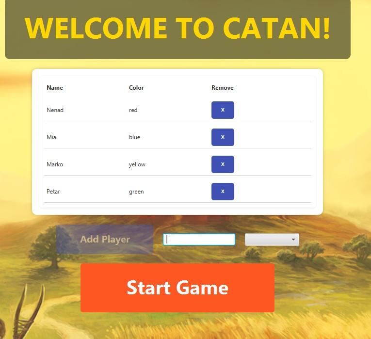

When the "Start Game" button is pressed, the game moves to the initial resource placement phase.
At the start of the game, each player has the right to place two settlements and two roads.
- First, the player whose turn it is places a settlement by clicking on a spot, then places a 
road by clicking on an edge adjacent to that spot.
- After that, the other players do the same in turn.

Once all players have placed their first settlements and roads, the game enters the second initial phase, where players place roads and settlements again, but in reverse order from the first 
phase.
- When a player places a settlement on a spot during this second phase, they receive resources from the areas surrounding that spot.
Example:
If players are Player1, Player2, and Player3
- In the first initial phase, Player1 places settlement and road first, then Player2, then Player3.
- In the second initial phase, Player3 places settlement and road first, then Player2, then Player1.

Players will see whose turn it is in the game message area.
For example, if player Nenad is on turn, the message will show:

If Player "Nenad" selects a spot during the second initial phase, 
he will receive resources from the adjacent edges.

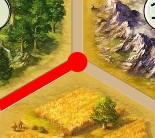

For example, he will receive the following resources:

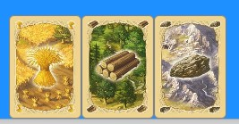

When this process finishes, the player should see the following on the game screen:

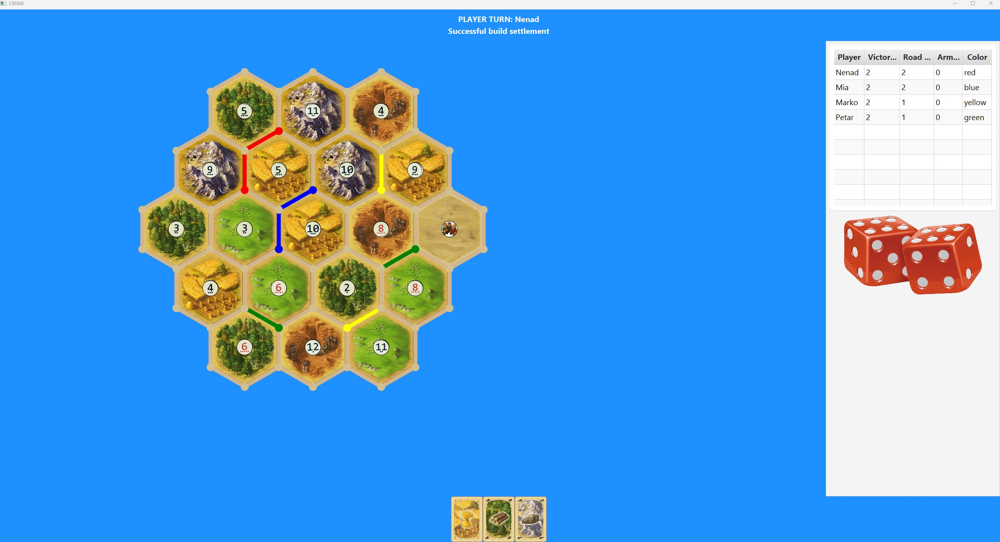

- At the top, the player can see who's turn it is.
- In the center, the map is displayed.
- On the side, there is the game interaction panel.
- At the bottom, the player’s hand of resources is shown.

By rolling the dice, the player receives a certain number. 
Each number corresponds to a specific area.
If a player’s settlement is located on the border of an area with that number,
that player receives the resource from that area

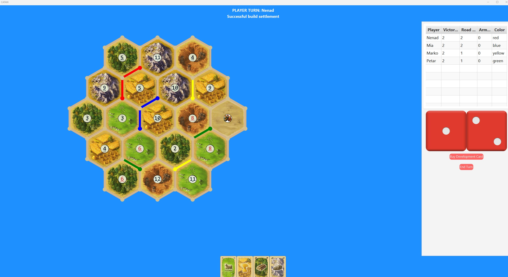

In the example image above, the player received the number 3.
Since their settlement is on an area rich in wool with the number 3, they receive the wool resource in their hand.
On the side, buttons will appear for the player to choose from.
The player ends their turn by pressing the "End Turn" button, after which the next player takes their turn.

### Roling dice
### Kupovina settlement
### Kupovina town
### Trade

If a player has 4 identical resources, they get the option to trade resources.
On the right side, a Buy Road button appears.

By clicking the Buy Card button, the player opens the shop window where they can:
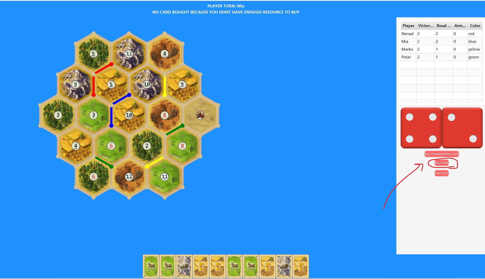
- Choose the resource they want to buy and click "Buy this card".
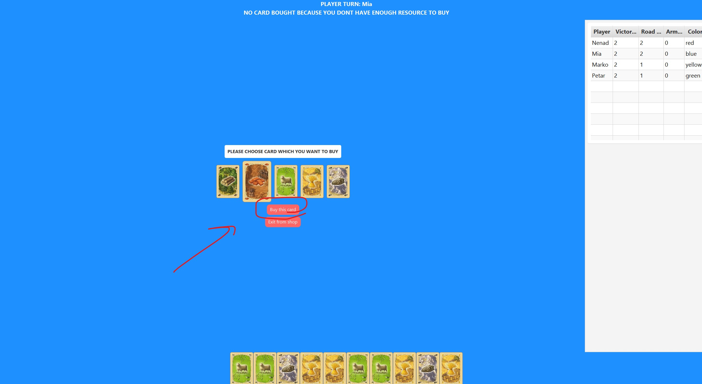
- Select the resource they want to sell and click "Sell this card" to trade in 4 identical resources.
  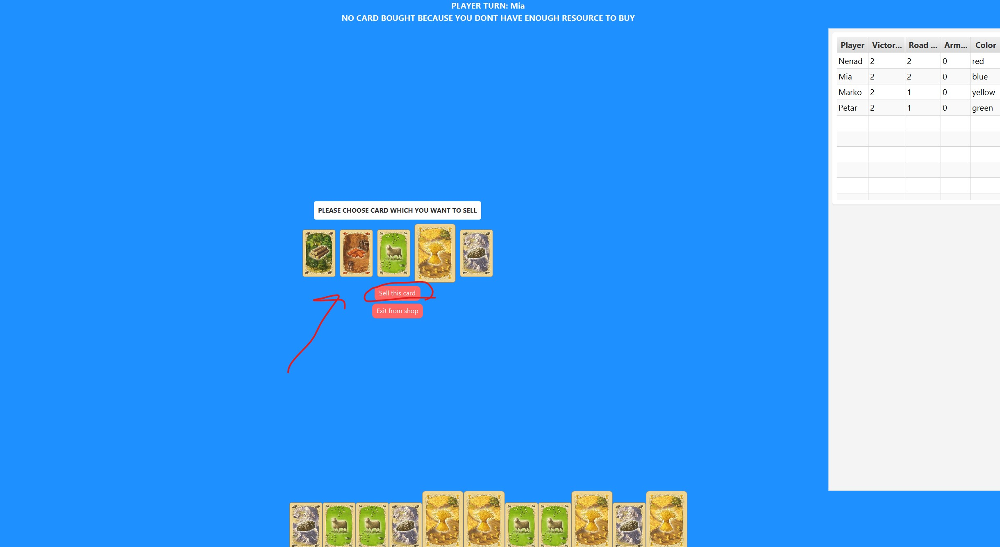
The player can exit the shop at any time.

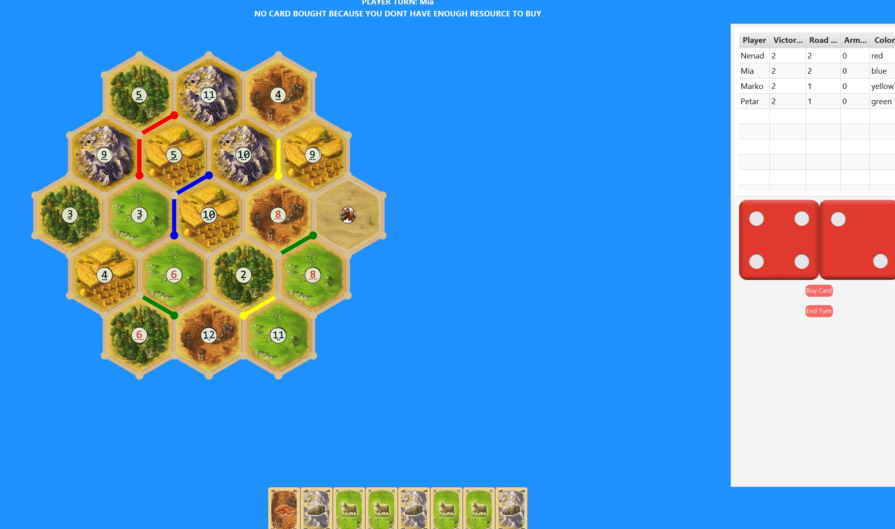

### Win

A player wins when they collect 10 victory points.

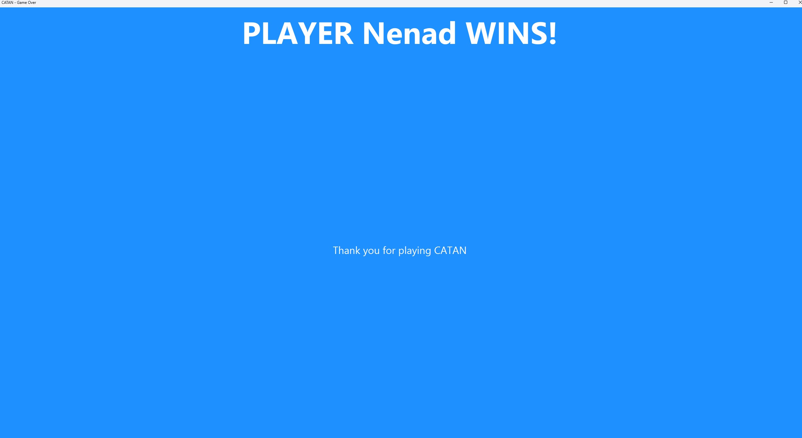

## Further Development
In the future, I plan to expand the game with exciting new features, 
including the ability for players to trade cards with one another, 
the creation of new and diverse game maps, and the introduction of additional expansions to enrich gameplay. 
There are also plans to develop both web and mobile applications to make the game more accessible. Furthermore,
new development cards will be added to offer players even more strategic options.

## Sources
https://www.catan.com/sites/default/files/2021-06/catan_base_rules_2020_200707.pdf
## License

Copyright © 2025 FIXME

This program and the accompanying materials are made available under the
terms of the Eclipse Public License 2.0 which is available at
http://www.eclipse.org/legal/epl-2.0.

This Source Code may also be made available under the following Secondary
Licenses when the conditions for such availability set forth in the Eclipse
Public License, v. 2.0 are satisfied: GNU General Public License as published by
the Free Software Foundation, either version 2 of the License, or (at your
option) any later version, with the GNU Classpath Exception which is available
at https://www.gnu.org/software/classpath/license.html.
